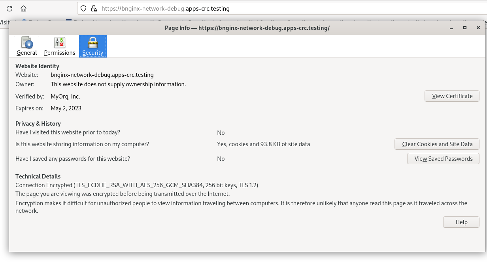

#Task 1

```
$oc get routes
No resources found in network-debug namespace.
$oc create route edge --service=quotes --hostname=quotes-network-debug.apps-crc.testing
route.route.openshift.io/quotes created

$curl -k https://quotes-network-debug.apps-crc.testing/status
Database connection OK
```

You can verify the cert with openssl command

```
echo quit | openssl s_client -showcerts -servername quotes-network-debug.apps-crc.testing -connect quotes-network-debug.apps-crc.testing:443
```

You can also get the cert extracted and use that without insecure mode in curl (-k option)

```
curl --cacert tls.crt https://quotes-network-debug.apps-crc.testing/status

# to view the headers
curl -I -v --cacert tls.crt https://quotes-network-debug.apps-crc.testing/status

```

nothing leaked in in the tcp dump :) 

```
[abc@foo 09:59:33 - q13]$sudo tcpdump -i crc -A -n port 443 | grep -i database
dropped privs to tcpdump
tcpdump: verbose output suppressed, use -v[v]... for full protocol decode
listening on crc, link-type EN10MB (Ethernet), snapshot length 262144 bytes


^C38 packets captured
38 packets received by filter
0 packets dropped by kernel
```


#Task 2

```
$oc delete routes.route.openshift.io quotes 
route.route.openshift.io "quotes" deleted
$oc create route edge --service=quotes --ca-cert=./quotes-network-debug.apps-crc.testing/rootCA.crt --cert=./quotes-network-debug.apps-crc.testing/quotes-network-debug.apps-crc.testing.crt --key=./quotes-network-debug.apps-crc.testing/quotes-network-debug.apps-crc.testing.key 
route.route.openshift.io/quotes created
$curl --cacert ./quotes-network-debug.apps-crc.testing/rootCA.crt https://quotes-network-debug.apps-crc.testing/status
Database connection OK
$ echo quit | openssl s_client -showcerts -servername quotes-network-debug.apps-crc.testing -connect quotes-network-debug.apps-crc.testing:443

```

# Task 3

creating secret from the files

```
$oc create secret tls bnginx-ssl --cert=./bnginx-network-debug.apps-crc.testing/bnginx-network-debug.apps-crc.testing.crt --key=./bnginx-network-debug.apps-crc.testing/bnginx-network-debug.apps-crc.testing.key 
secret/bnginx-ssl created

```

creating passtrhough route

```
$oc create route passthrough bnginx --service=bnginx
route.route.openshift.io/bnginx created
$oc get route
NAME     HOST/PORT                               PATH   SERVICES   PORT       TERMINATION   WILDCARD
bnginx   bnginx-network-debug.apps-crc.testing          bnginx     8443-tcp   passthrough   None
quotes   quotes-network-debug.apps-crc.testing          quotes     8000-tcp   edge          None

```

verify 

```
$curl --cacert ./bnginx-network-debug.apps-crc.testing/rootCA.crt https://bnginx-network-debug.apps-crc.testing
<!DOCTYPE html>
<html>
<head>
<title>Welcome to nginx!</title>
<style>
html { color-scheme: light dark; }
body { width: 35em; margin: 0 auto;
font-family: Tahoma, Verdana, Arial, sans-serif; }
</style>
</head>
<body>
<h1>Welcome to nginx!</h1>
<p>If you see this page, the nginx web server is successfully installed and
working. Further configuration is required.</p>

<p>For online documentation and support please refer to
<a href="http://nginx.org/">nginx.org</a>.<br/>
Commercial support is available at
<a href="http://nginx.com/">nginx.com</a>.</p>

<p><em>Thank you for using nginx.</em></p>
</body>
</html>

```

```
$echo quit | openssl s_client -showcerts -servername bnginx-network-debug.apps-crc.testing -connect bnginx-network-debug.apps-crc.testing:443 2>&1 | egrep "subject|example"
   i:C = US, ST = CA, O = "MyOrg, Inc.", CN = crc.example.com
subject=C = US, ST = CA, O = "MyOrg, Inc.", CN = bnginx-network-debug.apps-crc.testing
issuer=C = US, ST = CA, O = "MyOrg, Inc.", CN = crc.example.com
```

